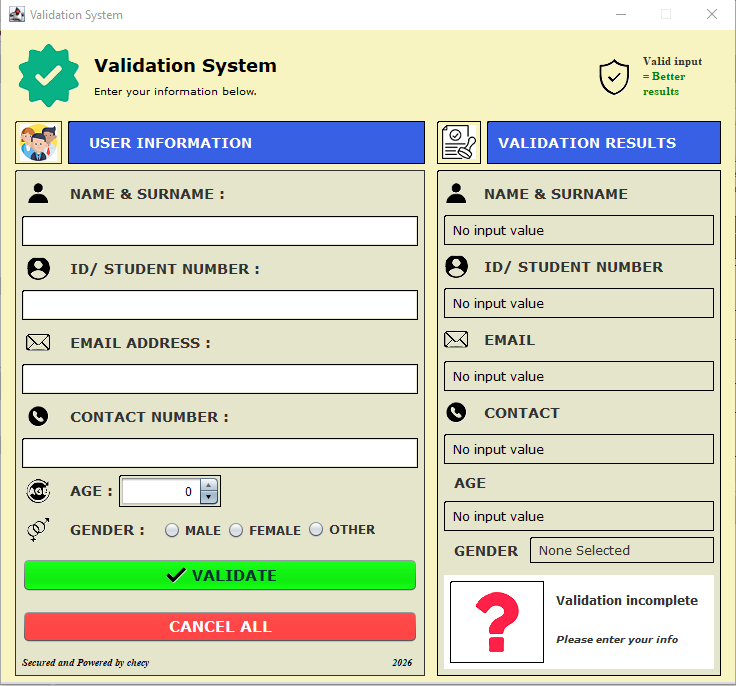

# Validation System

A Java Swing desktop application designed to capture, validate, and provide feedback on user information through a simple and user-friendly graphical interface.

## 📌 About the Project

The Validation System is a desktop application developed using Java Swing. It allows users to enter personal information and checks the entered data against validation rules.

The system provides feedback when information is incorrect and confirms when the entered information has successfully passed validation.

## ✨ Features

* 👤 Name and surname validation
* 🆔 ID / student number validation
* 🎂 Age / date of birth validation
* ⚧️ Gender selection
* 📱 Contact number validation
* 📧 Email address validation
* ✅ Validation feedback
* ❌ Error detection
* 🖥️ User-friendly graphical interface
* 🖼️ Custom icons and visual elements

## 🛠️ Technologies Used

* **Java**
* **Java Swing**
* **NetBeans**
* **Git**
* **GitHub**

## 📸 Application Screenshot



## 📂 Project Structure

```text
ValidationSystem/
├── README.md
├── screenshots/
│   └── validation-system-home.png
├── src/
│   └── validationsystem/
│       ├── ValidationSystem.java
│       ├── home.java
│       ├── home.form
│       └── images/
├── nbproject/
├── build.xml
├── manifest.mf
└── .gitignore
```

## ▶️ How to Run

1. Clone the repository from GitHub.
2. Open the project in **NetBeans**.
3. Allow NetBeans to load the project.
4. Build the project.
5. Run the application.
6. Enter the required information.
7. Submit the information for validation.

## 🎯 Project Purpose

The purpose of this project is to demonstrate practical Java programming skills, including:

* Java Swing GUI development
* Input validation
* Event handling
* User interaction
* Error handling
* Project organization
* Git and GitHub version control

## 🚀 Future Improvements

Possible future improvements include:

* Database integration
* User login and registration
* Storing validated records
* Editing and deleting saved records
* More advanced validation rules
* Improved user interface
* Exporting validation results

## 👨‍💻 Author

Developed as a Java desktop application project using Java Swing and NetBeans.
